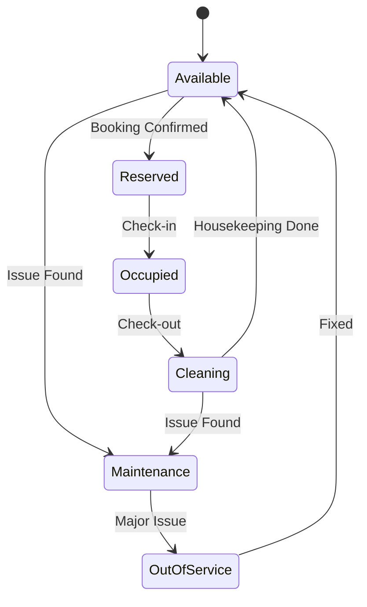
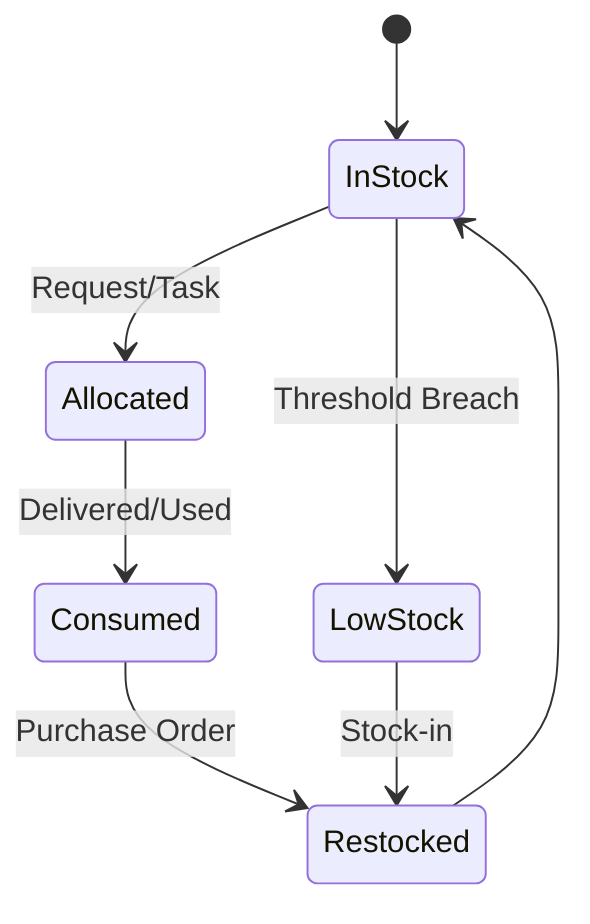

# 🏨 Hotel & Suite Management System — Complete Flow

A concise, GitHub‑ready reference for end‑to‑end operations across roles: **Guest**, **Front Office (FO)**, **Housekeeping**, **Admin**, and **Inventory**.

---

## 📚 Table of Contents

- [Overview](#overview)
- [System Roles](#system-roles)
- [Guest Flow (Customer Journey)](#-guest-flow-customer-journey)
- [Front Office (FO) Flow](#-front-office-fo-flow)
- [Housekeeping Flow](#-housekeeping-flow)
- [Admin Flow](#-admin-flow)
- [System Status Lifecycle](#-system-status-lifecycle)
- [End-to-End Flow Summary](#-end-to-end-flow-summary)
- [Extended: With Inventory](#-extended-with-inventory)

  - [Guest Flow (with Inventory Interactions)](#-guest-flow-with-inventory-interactions)
  - [Front Office (FO) Flow — Inventory Touchpoints](#-front-office-fo-flow--inventory-touchpoints)
  - [Housekeeping Flow — Inventory Touchpoints](#-housekeeping-flow--inventory-touchpoints)
  - [Admin Flow — Inventory Oversight](#-admin-flow--inventory-oversight)
  - [Inventory Flow](#-inventory-flow)
  - [Unified Status + Inventory Lifecycles](#-unified-status--inventory-lifecycles)
  - [End-to-End Example (with Inventory)](#-end-to-end-example-with-inventory)

- [Diagrams (Mermaid)](#-diagrams-mermaid)

  - [Swimlane (Flowchart with Lanes)](#swimlane-flowchart-with-lanes)
  - [Room Status — State Diagram](#room-status--state-diagram)
  - [Inventory Status — State Diagram](#inventory-status--state-diagram)

---

## Overview

This document describes the **complete operational flow** of a hotel & suite management system: from discovery and booking to check‑out, room turnaround, inventory consumption, and operational reporting.

---

## 👤 Guest Flow (Customer Journey)

**Discovery**

- Browse rooms/suites (website/app/front desk)
- View rates, amenities, photos, and availability

**Booking**

- Online or walk‑in booking
- Provide personal details, stay duration, special requests
- Receive booking reference/confirmation

**Check‑in**

- FO validates ID & booking
- Guest receives room key/digital access

**Stay**

- Room service & housekeeping requests
- Report issues via system/chatbot/front desk

**Check‑out**

- Settle payments
- Receive digital receipt
- Provide feedback

---

## 🧑‍💼 Front Office (FO) Flow

**Reservation Handling**

- Manage walk‑in & online bookings
- Verify availability & assign rooms

**Check‑in Process**

- Verify guest identity & payment guarantee
- Issue key card/digital access
- Update room status → **Occupied**

**During Stay**

- Handle guest requests & complaints
- Coordinate with housekeeping/admin

**Check‑out Process**

- Generate billing & receipts
- Update room status → **Cleaning**

---

## 🧹 Housekeeping Flow

**Task Assignment**

- FO/Admin assigns cleaning tasks
- System notifies housekeeping on guest check‑out

**Room Status Updates**

- **Cleaning → Available** when ready
- Mark **Maintenance Needed** if issues are found

**Guest Requests**

- Deliver amenities (towels, linens, toiletries)
- Log request completion in the system

---

## 🛠️ Admin Flow

**System Configuration**

- Define room types, pricing, promotions
- Manage seasonal rates & discounts

**User & Role Management**

- Add/update staff accounts (FO, housekeeping)

**Operations Oversight**

- Monitor bookings, occupancy, and revenue
- Approve/reject cancellations or escalations

**Reports & Analytics**

- Occupancy, revenue trends, housekeeping performance
- Guest history & preferences

---

## 🔄 System Status Lifecycle

- **Room:** Available → Reserved → Occupied → Cleaning → Available
- **Special States:** Maintenance, Out of Service

---

## 📊 End-to-End Flow Summary

1. Guest searches & books
2. FO verifies booking & assigns room
3. Guest checks in → room status = **Occupied**
4. During stay → requests handled by FO & housekeeping
5. Guest checks out → FO updates room status = **Cleaning**
6. Housekeeping cleans → updates to **Available**
7. Admin monitors → analytics & reports

---

## 🔧 Extended: With Inventory

### 👤 Guest Flow (with Inventory Interactions)

**Search & Booking**

- Browse rooms/suites; select dates → confirm booking → receive booking ID

**Check‑in**

- FO validates booking → assigns room → issues key

**During Stay**

- Requests (extra pillow, toiletries, food/drinks)
- Minibar consumption is tracked to inventory

**Check‑out**

- FO finalizes bill (room + minibar + services)
- Guest pays → receipt issued

### 🧑‍💼 Front Office (FO) Flow — Inventory Touchpoints

**Booking & Reservation**

- Manage walk‑in/online bookings
- Assign room → mark **Reserved/Occupied**

**Check‑in/Check‑out**

- Manage guest profiles
- Update billing (room + inventory usage)

**Service Requests**

- Log guest requests → trigger housekeeping/inventory updates

**Inventory Tracking (via requests)**

- Example: guest requests towel → FO logs → housekeeping delivers → **inventory decreases**

### 🧹 Housekeeping Flow — Inventory Touchpoints

**Room Status**

- Update **Cleaning → Available**

**Guest Requests**

- Deliver items (linens, toiletries, water)
- Log usage → deducted from inventory

**Cleaning Supplies**

- Request restock (detergent, soap, etc.)

**Maintenance Flag**

- Mark **Maintenance Needed** if issues found

### 🛠️ Admin Flow — Inventory Oversight

- Configure room types, rates, amenities
- Manage roles: FO, housekeeping, inventory staff
- Monitor bookings, occupancy, revenue
- **Inventory Oversight:** track usage (toiletries, linens, food/drink stock), generate low‑stock alerts, approve purchase orders
- **Reports & Analytics:** occupancy rate, sales trends, housekeeping performance, inventory (consumption, wastage)

### 📦 Inventory Flow

**Stock‑In (Procurement)**

- Supplier delivers → Admin/Inventory staff logs items
- Categories: linens, toiletries, minibar items, cleaning supplies

**Stock Allocation**

- Housekeeping takes supplies for cleaning
- FO approves guest‑requested items (towels, shampoo, water)
- Minibar restocked

**Stock‑Out (Usage)**

- When items are used → deducted from inventory

**Monitoring & Alerts**

- System tracks stock levels → auto‑alert for low stock

**Reporting**

- Daily/Monthly consumption reports
- Cost tracking & budget planning

### 🔄 Unified Status + Inventory Lifecycles

- **Room:** Available → Reserved → Occupied → Cleaning → Available
- **Inventory:** In Stock → Allocated → Consumed → Restocked

### 📊 End-to-End Example (with Inventory)

1. Guest books → FO assigns room
2. Guest requests extra towel → FO logs → Housekeeping delivers → **Inventory auto‑deducted**
3. Guest consumes minibar → **Inventory auto‑deducted**
4. Check‑out → FO finalizes bill (room + minibar + extras)
5. Housekeeping cleans → consumes supplies → room → **Available**
6. Admin reviews revenue + inventory usage reports

---

## 🧭 Diagrams (Mermaid)

> Copy/paste these into your README to render on GitHub (Mermaid is supported).

### Swimlane (Flowchart with Lanes)

```mermaid
flowchart LR
  %% Lanes as subgraphs
  subgraph G[Guest]
    G1[Search & Book]
    G2[Check-in]
    G3[Stay: Requests & Minibar]
    G4[Check-out]
  end

  subgraph F[Front Office (FO)]
    F1[Receive Booking & Assign Room]
    F2[Set Room = Reserved/Occupied]
    F3[Log Requests → Route]
    F4[Generate Bill]
    F5[Process Check-out → Set Cleaning]
  end

  subgraph H[Housekeeping]
    H1[Receive Tasks]
    H2[Deliver Items]
    H3[Clean Room]
    H4[Update Status → Available]
    H5[Flag Maintenance]
  end

  subgraph A[Admin]
    A1[Configure Rooms/Rates]
    A2[Manage Users]
    A3[Oversee Ops]
    A4[Approve Purchase Orders]
    A5[Reports & Analytics]
  end

  subgraph I[Inventory]
    I1[Stock-in (Log Items)]
    I2[Allocate to Requests]
    I3[Deduct Usage]
    I4[Low-stock Alerts]
    I5[Inventory Reports]
  end

  %% Cross-lane interactions
  G1 --> F1
  F1 --> G2
  G2 --> F2
  G3 -- Requests --> F3
  F3 --> H2
  F3 --> I2
  G3 -- Minibar --> I3
  G4 --> F4
  F4 --> F5
  F5 --> H3
  H3 --> H4
  I4 --> A4
  I5 --> A5
  A3 -. oversight .-> F1
  A3 -. oversight .-> H1
```

### Room Status — State Diagram



### Inventory Status — State Diagram



---

## ✅ Notes

- Keep **status transitions** authoritative; drive UI badges and automation from these.
- Log **every inventory movement** (stock-in, allocation, consumption) for auditability.
- Route **guest requests** through FO for visibility, even when self‑service is available.

---

## 📝 License

Add your project license here.
